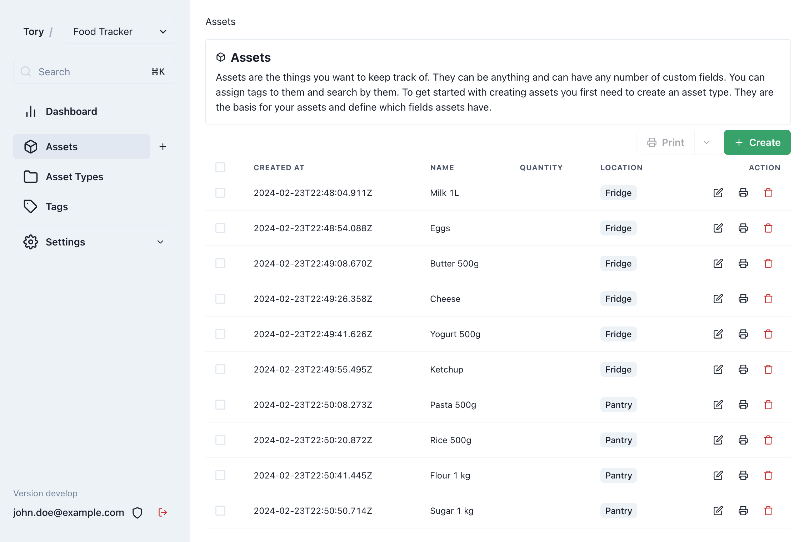

  <h1><code>tory</code></h1>
  

    <strong>A versatile inventory system for everything and anything.</strong>
  

  

## Features

- ✅ Track all your items with ease. [Learn how](./docs/usage/getting-started.md)
- ✅ Print customizable labels for efficient organization. [Start printing](./docs/usage/label-printing.md)
- ✅ Collaborate on inventories with teams. [Explore collaboration](./docs/usage/teams.md)
- ✅ Secure access with Single Sign-On (SSO). [Set up SSO](./docs/hosting/configuration.md#authentication)
- ✅ Leverage advanced search capabilities through [MeiliSearch](https://www.meilisearch.com/)

## Getting Started

> [!NOTE]  
> Tory is currently in [pre-release](./docs/hosting/updating.md). Please proceed with caution.

Deploying Tory is straightforward with Docker. Check out the [hosting documentation](./docs/hosting/hosting.md) to get your instance up and running today. For an in-depth look into Tory's capabilities, the [usage guide](./docs/usage/getting-started.md) is the perfect place to start.

## How Tory Works

Tory is designed to make inventory management a breeze. From pantry staples and literary collections to collectible treasures, Tory seamlessly adapts to your unique needs. Dive into a few fundamental concepts to fully leverage Tory’s capabilities.

Discover more in the [Usage Guide](./docs/usage/getting-started.md).

### Assets

Define "assets" as items you wish to track, whether they're groceries, books, or collectibles. Tory enables you to monitor any number of assets, ensuring you always stay organized.

Dive deeper: [Understanding Assets](./docs/usage/assets.md)

### Asset Types

Asset Types introduce structure to your inventory. Customize the details you track for each item category, like author, genre, and page count for books, to make your inventory system truly yours.

Learn more: [Setting Up Asset Types](./docs/usage/asset-types.md)

### Tags

Organize your assets with tags for effortless filtering. Whether marking books as `unread` or categorizing pantry items, tags simplify finding exactly what you need, when you need it.

Explore further: [Using Tags](./docs/usage/tags.md)

### Teams

With Teams, you can group assets, asset types, and tags, creating distinct inventories for different purposes or groups. Share your collections with others by inviting them to your team, from family members sharing pantry items to colleagues collaborating on business inventories.

More information: [Working with Teams](./docs/usage/teams.md)

## Contribute

As Tory evolves, your input is invaluable. I encourage you to test Tory, share your feedback, and contribute ideas to enhance its development. Found a bug or have a feature in mind? Create an issue and let me know!
