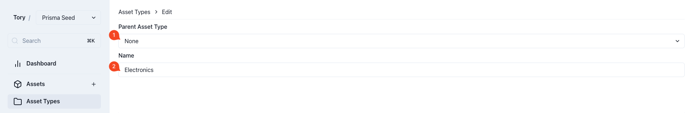
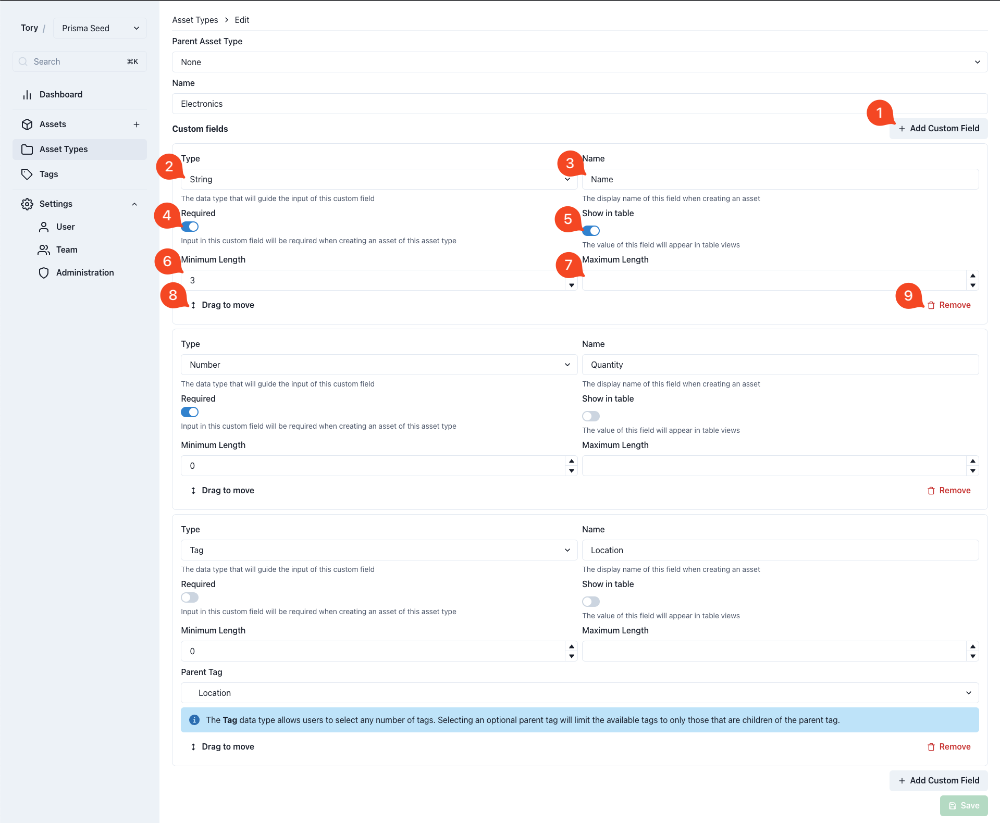
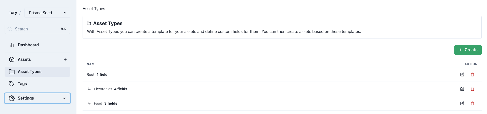

# Asset Types

They give the assets structure. Tory can handle a wide variety of assets, but it doesn't know what about to be tracked. The Asset Types tell Tory exactly what kind of assets it should store and what fields they should have.

For example, the food item in the fridge may need different fields and information attached to them, then the electronics in the office.

## Creating an Asset Type

1. Specify the parent asset type of this asset type. This allows for inheritance as [outlined further here](#inheritance).
2. Name of the asset type

### Custom Fields

The so called Custom Fields are basically a form builder. Here is specified which fields are later available when creating assets.

1. Add a new custom field
2. Specify data type of this field. See [Data Types](#data-types).
3. Name of the field. Assets are a blank canvas. If you want assets to have a name, you need to create a custom field "Name", like in this example.
4. Marking a field as required, makes input to that field mandatory when creating asset types.
5. Setting the field to "Show in table" will add a column to the asset table later on where the corresponding value can be seen. Otherwise the list of assets it rather empty. Having one field with a name that is shown in tables will make it easier to identify assets later on.
6. The minimum length has a slightly different behaviour depending on the data type. On strings, like in this example, it will require that the user is entering a "Name" with at least 3 characters in length.
7. The maximum length behaves the same. Giving now value here will allow infinite amount of characters.
8. The custom fields will display in the same order as they have been added here when a new asset is created. This order can be tweaked via drag and drop.
9. Fields can be removed using this button. Caution! This will also remove the data of assets that already have this field filled!

#### Data Types

<table>
  <tr>
    <th>Data Type</th>
    <th>Description</th>
  </tr>
  <tr>
    <td>String</td>
    <td>They will render as a single line input field and can hold any kind of manual input. Calculation of numbers is not possible on strings, for that rather use number.</td>
  </tr>
  <tr>
    <td>Number</td>
    <td>They allow for more controlled input. Values can only be numbers.</td>
  </tr>
  <tr>
    <td>Boolean</td>
    <td>They render as a switch as it can be seen used for the "Required" flag for example. They have two states, on or off.</td>
  </tr>
  <tr>
    <td>Date</td>
    <td>Dates have handy date picker where the user can simply select a date from.</td>
  </tr>
  <tr>
    <td>Tag</td>
    <td>They render as selector where the user has to select tags. Tags allow to categorize assets. For example, books have a tag with either "read" or "unread". This makes use of the hierarchical nature of tags. The user can pick child tags of the here selected "Parent Tag". See the [Tags](./tags.md) documention for more details.</td>
  </tr>
</table>

## Inheritance

Asset types can be hierarchical. This is what the "Parent Asset Type" dropdown is for. This is optional. 

When a parent asset type is selected it will inherit all the custom fields of the selected parent. This allows for a level of abstraction and eases the creation of multiple asset types for different purposes without having to redefine all the custom fields.

For example, food items and electronic devices may both have a name. One can now create a common asset type with custom fields that both have in common:

The "Root" asset type has 1 field (a "Name"). Which is then inherited to "Electronics" and "Food" automatically. Once an asset of type "Food" is created the "Name" field becomes available automatically, even though it has not been created inside the "Food" asset type explicitly.
