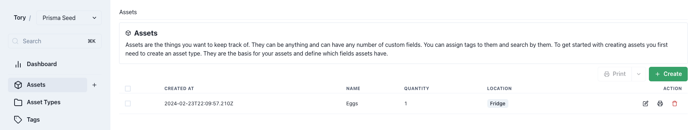
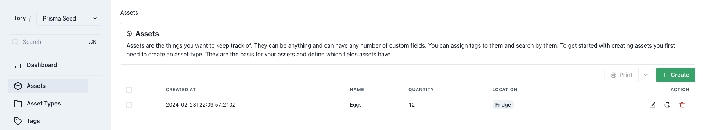

# Assets

Assets represent the items managed within Panthora, reflecting its capability to track virtually anything.

Assets can range from to-do list items, food inventory in a fridge, book collections, to personal finance tracking.

> [!TIP]
> Read the [example use-case](./example-home-library.md) to learn about the practical capabilities of Panthora.

## Creating an Asset

> [!NOTE]
> Consult the [Asset Types documentation](./asset-types.md) prior to creating an asset.

### Asset Configuration

<table>
  <tr>
    <th>Number</th>
    <th>Description</th>
  </tr>
  <tr>
    <td>1</td>
    <td>Select the appropriate asset type for the new asset.</td>
  </tr>
  <tr>
    <td>2</td>
    <td>Upon selecting an asset type, relevant fields for the asset will be displayed. For example, an asset of type "Food" may require four specific fields to be completed.</td>
  </tr>
</table>

Panthora's flexibility allows it to function as a food tracker, assisting in inventory management. Utilizing tags can enhance organization, such as indicating the location of items like eggs.
