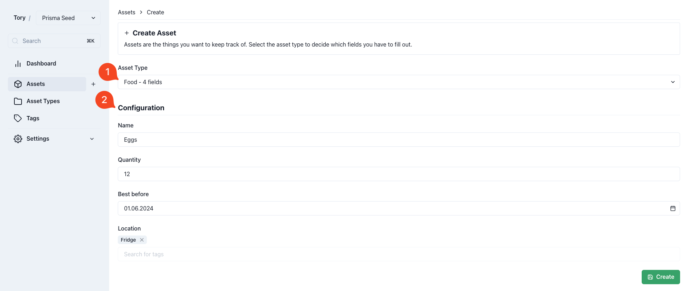

# Assets

This are the items that Tory will keep track of. From the flexible nature of Tory, assets can be anything.

Assets could be the items on a to-do list, the food in a fridge, the books in a collection, your personal finance tracker, you name it.

## Creating an Asset

> [!NOTE]  
> Read the [Asset Type](./asset-types.md) docs first before creating an asset.

1. Select the asset type this asset belongs to.
2. Once the asset type is selected the configuration will reveal all the fields that need to be filled for an asset of type "Food". The "Food" has 4 fields in this case.

Here use Tory as food tracker to help tracking what we still have at home while being out for shopping. Notice the use of tags to say where the eggs are located.

