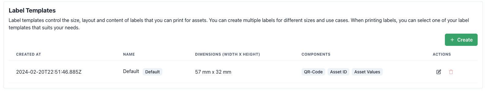

# Label Printing

Tory allows to print custom labels that can be sticked on physical items. The QR code helps to quickly find the physical item in front of you in the digital inventory.

## Label Templates

Different assets require different sized labels. Label templates allow exactly that. There can be multiple templates depending on the needs of the asset. During printing the template that should be used can be specified or the default configured template is used.

### Editing

Currently, only printing on label rolls is supported. Tory will automatically generate labels based on the configured settings as a PDF that can be printed.

It sometimes takes a bit to perfectly tweak the settings and sizes to print perfect labels, but the settings should allow a wide variety of labels:

The visibility of the content of the label can be configured here as well.

<table>
  <tr>
    <th>Setting</th>
    <th>Description</th>
  </tr>
  <tr>
    <td>Name</td>
    <td>There can be many templates for different kind of configs. Giving it a descriptive name helps later on.</td>
  </tr>
  <tr>
    <td>Width in mm</td>
    <td>The width of physical labels in milimeters.</td>
  </tr>
  <tr>
    <td>Height in mm</td>
    <td>The height of physical labels in milimeters.</td>
  </tr>
  <tr>
    <td>Padding in mm</td>
    <td>Not every printer can print at the very edge of the label. With the padding, equal space is added to the edge to ensure everything is visible when printed.</td>
  </tr>
  <tr>
    <td>Font size</td>
    <td>Depending on the label size a smaller or bigger font may be necessary.</td>
  </tr>
  <tr>
    <td>QR-Code Scale</td>
    <td>This controls the size of the QR-Code, when enabled.</td>
  </tr>
  <tr>
    <td>Default</td>
    <td>There can only configure one Label Template as default. Whenever a quick print option is used in the UI, that Label Template will be used by default.</td>
  </tr>
  <tr>
    <td>Show QR-Code</td>
    <td>Show or hide the QR-Code on the label</td>
  </tr>
  <tr>
    <td>Show Asset ID</td>
    <td>Show or hide UUID of the asset. This allows to search for the first few characters in Tory to find it quickly.</td>
  </tr>
  <tr>
    <td>Show Asset Text</td>
    <td>This will show the data attached to assets. Important! All fields of the asset will be rendered, but only if "Show in table" has been checked on the corresponding field of the Asset Type.</td>
  </tr>
</table>

### Printing

On the "Assets" page are several options to print labels for assets.

1. Select all or any number of assets to print labels for.
2. Once selected the "Print n labels" button will allow to print labels for all selected assets using the default Label Template.
3. Using the dropdown next to it, the template that should be used can be changed.
4. The inline print button allows to just print one label for the respective asset.
