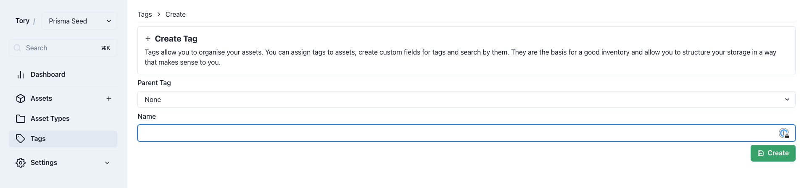
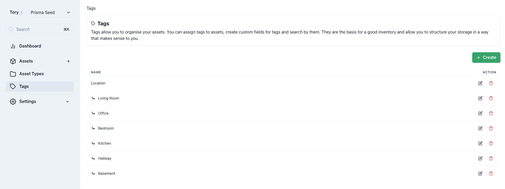

# Tags

Tags provide additional structure to assets through states, categories, locations, and more, enhancing organizational capabilities.

## Creating Tags

The process for creating tags is straightforward. Each tag can optionally have a parent tag to establish hierarchy and should possess a descriptive name for easy identification.

## Hierarchical Tags

Tags can be organized hierarchically, similar to [asset types](./asset-types.md), enhancing logical organization without inheriting properties. This structure is particularly useful for categorizing assets by location or other hierarchical categories.

For instance, a "Location" tag can serve as a parent for various room tags, specifying where assets are located. The "Parent Tag" selector assigns child tags to their respective parent.

Hierarchical tagging benefits asset types by utilizing the "Tag" [data field type](./asset-types.md#data-types), enabling dropdown selections of child tags under a specified parent tag for precise asset location categorization.

