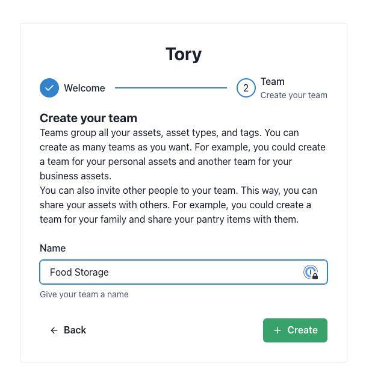
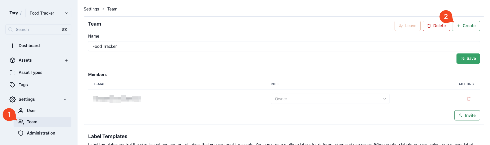
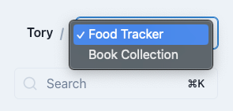

# Teams

Teams physically separate all the [asset types](./asset-types.md), [tags](./tags.md) and [assets](./assets.md).
A user can have multiple teams to create separate inventories. While one can keep track of books, food and their to-do list all within one team, it may makes sense to split some to a different team.

## Collaboration

It's called Teams and not Projects, because users can invite other's to collaborate on their inventory. This is useful to share the food tracker with your family so everyone know what is still in stock.

## Creating a Team

On the first login, users are prompted to create their first team:

Creating additional teams, can be done in the Team Settings:

## Switching Teams

If a user has access to multiple teams, they can only view the data of one team at a time. To look at Tory from the perspective of another team, they have to switch teams in the top-left corner

## Invite Users

Users can invite other's to their team using their E-Mail address. This can be done in the team settings as well.

> [!Important]  
> Tory is not sending E-Mails! If you invite a user by an E-Mail address that they have not been registered with, they will have create an account themselves. You can still invite them already, and once they created an account, the invitation can be accepted by them.

If a user is invited to a team, they have 48 hours to accept the invitation. The invitation will be shown as a banner in the Tory UI. They may decline, accept or the invitation expires.

## Team Member Roles

Team members have different roles that allow them different actions in the scope of the team. The roles may be different depending on the team the user is a member of. They could be `Owner` of one team, but only `Member` of another.

<table>
  <tr>
    <th>Role</th>
    <th>Description</th>
  </tr>
  <tr>
    <td>Member</td>
    <td>They interact with the inventory. They can read and write all tags, asset types and assets.</td>
  </tr>
  <tr>
    <td>Admin</td>
    <td>They have all the permissions of the `Member`, but additionally can also administrate the team. They can invite other users to the team. They cannot delete a team.</td>
  </tr>
  <tr>
    <td>Owner</td>
    <td>This is the original owner of that team. They cannot be removed, nor can there be multiple owners. They have unrestricted access to the entire team and may even delete the team including all data belonging to it. They can also invite other members. Owners cannot leave their own team.</td>
  </tr>
</table>
