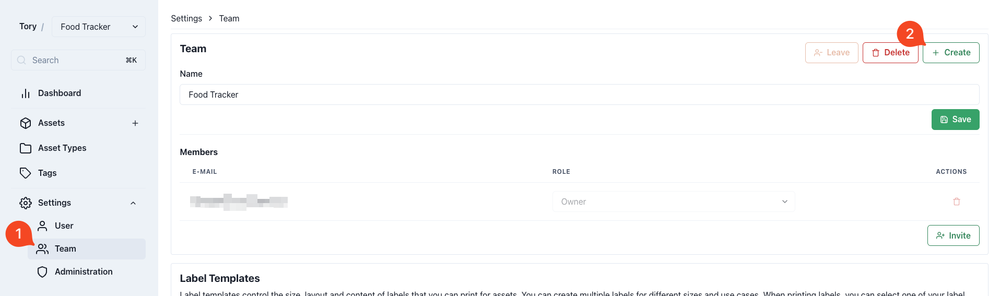

import { Callout } from "nextra/components";

# Collaboration

Teams function to segregate [asset types](./asset-types), [tags](./tags), and [assets](./assets), facilitating the creation of distinct inventories within Panthora. Users can establish multiple teams to manage diverse inventories such as books, food, or to-do lists separately or within a single team.

## Collaboration

Named "Teams" to emphasize collaborative efforts, this feature enables users to invite others to manage an inventory together. This is particularly useful for sharing a food tracker with family members to keep everyone informed about stock levels.

## Creating a Team

Upon first login, users are prompted to create their initial team:

To create additional teams, navigate to Team Settings:

## Switching Teams

Users with access to multiple teams can view data from only one team at a time. Switching between teams is facilitated through the team selector in the top-left corner:

## Invite Users

Invitations to join a team are sent via email. This process is managed within the team settings:

<Callout type="warning">
  Panthora does not send emails. If the invitee does not have an account under that email address yet, they can still be invited, but you will have to tell them to register. Once registered they can accept the invitiation that was sent. Invitations are valid for 48 hours and appear as a banner in the Panthora UI, where they can be accepted or declined.
</Callout>

## Team Member Roles

Team members are assigned roles, determining their permissions within the team. Roles vary by team, allowing a user to be an `Owner` of one team while serving as a `Member` of another.

<table>
  <tr>
    <th>Role</th>
    <th>Description</th>
  </tr>
  <tr>
    <td>Member</td>
    <td>
      Can read and write all tags, asset types, and assets, interacting directly
      with the inventory.
    </td>
  </tr>
  <tr>
    <td>Admin</td>
    <td>
      Includes all Member permissions plus the ability to manage team settings,
      such as inviting users. Cannot delete the team.
    </td>
  </tr>
  <tr>
    <td>Owner</td>
    <td>
      The team's creator with full access to all team data and settings,
      including the ability to delete the team. There is only one Owner per
      team, who cannot leave or be removed from the team.
    </td>
  </tr>
</table>
