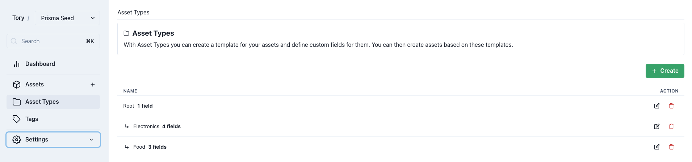

import { Steps } from "nextra/components";
import { DocsImage } from "~/components";

# Asset Types

Asset Types provide structure to assets. Given the diverse nature of assets Panthora manages, defining Asset Types is crucial for specifying the kinds of assets to be stored and the fields they should possess.

For instance, food items and office electronics may require different fields and information.

## Creating an Asset Type

### Overview

<DocsImage path="assetTypes/create-1" />

<Steps>
### Step 1

Specify the parent asset type for inheritance, as detailed in the <a href="#inheritance">Inheritance section</a>.

### Step 2

Name of the Asset Type.

</Steps>

### Custom Fields

Custom Fields act as a form builder, dictating which fields will be available when creating assets.

<DocsImage path="assetTypes/create-2" />

<Steps>
### Step 1

Add a new custom field.

### Step 2

Specify the data type of this field, referencing the <a href="#data-types">Data Types section</a>.

### Step 3

Field name. To include a name for assets, create a custom field titled "Name".

### Step 4

Marking a field as required makes it mandatory for asset type creation.

### Step 5

"Show in table" adds the field as a column in the asset table, aiding asset identification.

### Step 6

The minimum length requirement varies by data type, ensuring at least 3 characters for strings.

### Step 7

The maximum length limit, with no value allowing an infinite character count.

### Step 8

Field order in asset creation can be adjusted via drag and drop.

### Step 9

Fields can be removed, which also deletes data from assets containing these fields.

</Steps>

#### Data Types

<table>
  <tr>
    <th>Data Type</th>
    <th>Description</th>
  </tr>
  <tr>
    <td>String</td>
    <td>
      Single line input for any text, not suitable for numerical calculations.
    </td>
  </tr>
  <tr>
    <td>Number</td>
    <td>Accepts only numerical values, ensuring controlled input.</td>
  </tr>
  <tr>
    <td>Boolean</td>
    <td>
      Renders as a toggle switch, useful for binary states such as "Required".
    </td>
  </tr>
  <tr>
    <td>Date</td>
    <td>Includes a date picker for easy date selection.</td>
  </tr>
  <tr>
    <td>Tag</td>
    <td>
      Selection field for tags, facilitating asset categorization. Parent tag
      selection enables hierarchical tag usage. Further details in{" "}
      <a href="./tags.md">Tags documentation</a>.
    </td>
  </tr>
</table>

## Inheritance

Asset Types can inherit fields from a parent, streamlining the creation of related asset types without duplicating custom fields.

### Example

The "Root" asset type includes a "Name" field, inherited by both "Electronics" and "Food". This inheritance ensures that creating an asset under "Food" automatically includes the "Name" field, even if not explicitly defined within the "Food" asset type.
