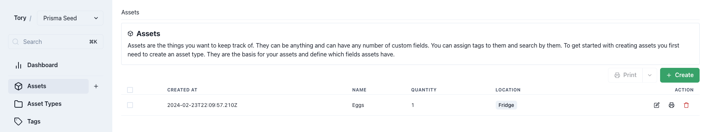
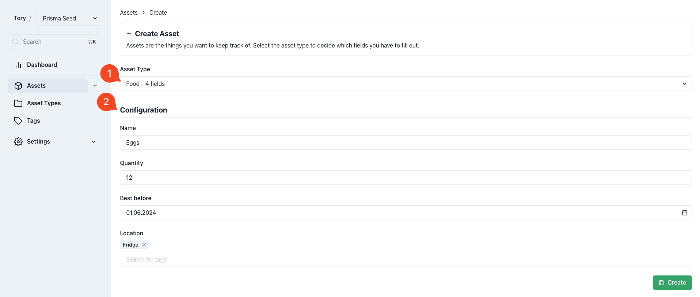

import { Callout, Steps } from "nextra/components";

# Assets

Assets represent the items managed within Panthora, reflecting its capability to track virtually anything.

Assets can range from to-do list items, food inventory in a fridge, book collections, to personal finance tracking.

<Callout type="info">
  Read the [example use-case](../templates/example-home-library) to learn about
  the practical capabilities of Panthora.
</Callout>

## Creating an Asset

<Callout type="default">
  Consult the [Asset Types documentation](./asset-types) prior to creating an
  asset.
</Callout>

### Asset Configuration

<Steps>
  ### Step 1 Select the appropriate asset type for the new asset. ### Step 2
  Upon selecting an asset type, relevant fields for the asset will be displayed.
  For example, an asset of type "Food" may require four specific fields to be
  completed.
</Steps>

Panthora's flexibility allows it to function as a food tracker, assisting in inventory management. Utilizing tags can enhance organization, such as indicating the location of items like eggs.
