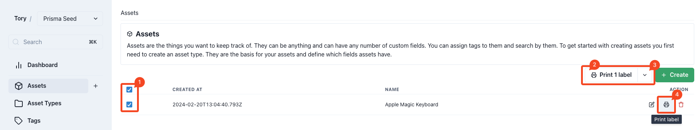

# Label Printing

Panthora facilitates the creation of custom labels, equipped with QR codes, for physical items to seamlessly integrate them into the digital inventory.

## Label Templates

Label Templates cater to the need for various label sizes across different assets. Users can choose from multiple templates or rely on a pre-configured default during the printing process.

### Template Configuration and Usage

### Editing and Customization

Panthora supports printing on label rolls, automatically generating a PDF of labels based on user-defined settings.

Adjustments may be necessary to achieve optimal label sizing, but the available settings accommodate a broad spectrum of label dimensions.

### Label Content Settings

<table>
  <tr>
    <th>Setting</th>
    <th>Description</th>
  </tr>
  <tr>
    <td>Name</td>
    <td>Descriptive naming for templates aids in later selection.</td>
  </tr>
  <tr>
    <td>Width in mm</td>
    <td>Label width in millimeters.</td>
  </tr>
  <tr>
    <td>Height in mm</td>
    <td>Label height in millimeters.</td>
  </tr>
  <tr>
    <td>Padding in mm</td>
    <td>
      Padding compensates for printers' edge limitations, ensuring content
      visibility.
    </td>
  </tr>
  <tr>
    <td>Font size</td>
    <td>Font size adjustments ensure readability relative to label size.</td>
  </tr>
  <tr>
    <td>QR-Code Scale</td>
    <td>Determines the QR code size on the label.</td>
  </tr>
  <tr>
    <td>Default</td>
    <td>One template can be set as default for quick print actions.</td>
  </tr>
  <tr>
    <td>Show QR-Code</td>
    <td>Option to display or hide the QR code.</td>
  </tr>
  <tr>
    <td>Show Asset ID</td>
    <td>
      Toggle to display or hide the asset's UUID, facilitating quick searches
      within Panthora.
    </td>
  </tr>
  <tr>
    <td>Show Asset Text</td>
    <td>
      Displays asset data fields marked as "Show in table" within the asset type
      configuration.
    </td>
  </tr>
</table>

### Printing Process

Options for printing labels are accessible from the "Assets" page.

1. Assets can be selected individually or in bulk for label printing.
2. The "Print n labels" button activates upon selection, using the default Label Template.
3. A dropdown allows for template selection, altering the print configuration.
4. An inline print option facilitates single-label printing for specific assets.
